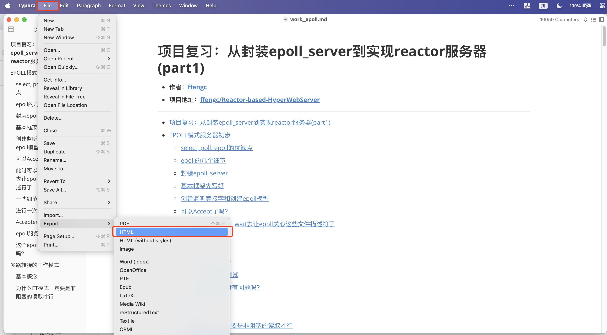

# Blog Configuration Repository

- **[简体中文](./README-cn.md)**
- **[English](./README.md)**

***

- [Blog Configuration Repository](#blog-configuration-repository)
  - [About This Project](#about-this-project)
  - [How to Use This Template](#how-to-use-this-template)
    - [Generate HTML Pages Using Typora](#generate-html-pages-using-typora)
    - [Deploy to the Project](#deploy-to-the-project)
    - [Link to the Blog's Main Page](#link-to-the-blogs-main-page)
  - [References](#references)

***

## About This Project

**This is my personal blog configuration**

This template is designed based on my personal homepage template and does not use any frameworks.

This template has the following advantages:
- Write blogs using Markdown
- Easy to understand
- Easy to use
- Simple and elegant
- Theme and style of the blog content page can be switched freely
- Very lightweight

## How to Use This Template

### Generate HTML Pages Using Typora

First, deploying this blog requires the help of the software Typora.

- [Typora Official Website](https://typora.io/)

After completing the blog with Markdown, use Typora to generate the corresponding HTML file.



If you have any questions, please leave them in this repository or on my personal homepage repository, and I will contact you.

### Deploy to the Project

In the `./blogs` directory are all the blogs, the directory needs to have HTML files and the corresponding assets directory to store images.

```bash
├── blogs
│   ├── Apache-and-Nginx
│   │   ├── Apache-and-Nginx.html
│   │   ├── Apache-and-Nginx.md
│   │   └── assets
│   │       ├── 1.png
│   │       └── 2.png
```

### Link to the Blog's Main Page

In `./index.html`

```html
<h2>📚<strong>Blogs</strong></h2>
```

Below are the links to the blogs, just modify the blog's name, link, image, and date accordingly.

```html
<li>
    <div class="blog-item">
        
        <div class="blog-info">
            <a href="./blogs/Apache-and-Nginx/Apache-and-Nginx.html" target="_blank">
                <strong class="kaishu">What are Apache and Nginx? | What is Nginx and Reactor? | The Essence of Network IO | Blocking Queue | Asynchronous Non-blocking IO</strong>
            </a>
            <span class="date">2023-08</span>
        </div>
    </div>
</li>
```

## References

Design based on [Qiaolin Yu](https://github.com/Qiaolin-Yu)'s personal homepage.

Feel free to use this translated content for your blog configuration documentation!
