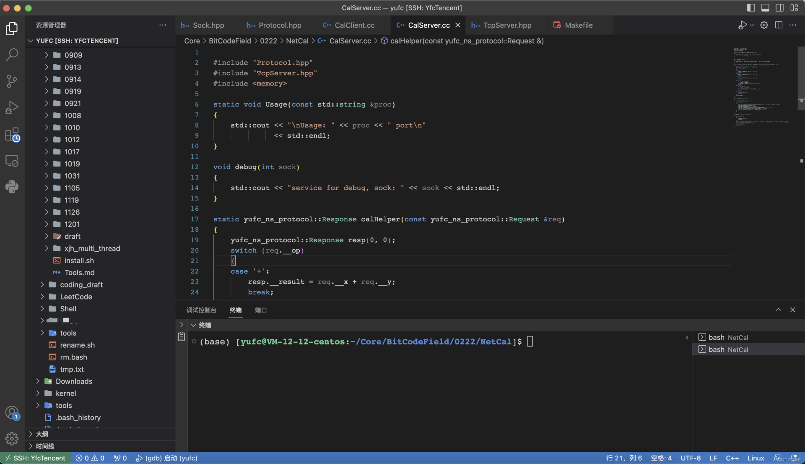
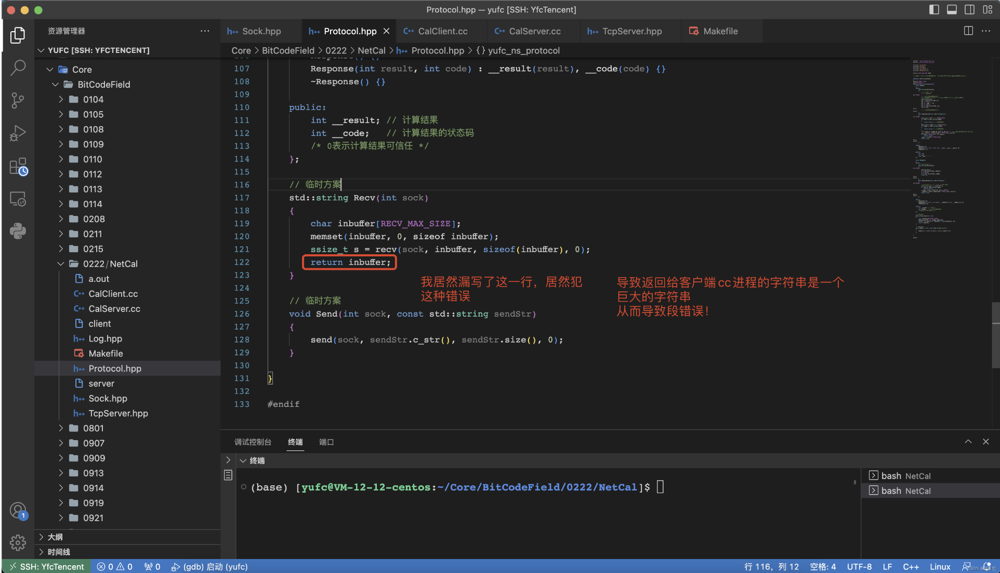

# 关于debug一晚上的一些思考，做开发到底要养成什么习惯？

2023-04-24

## 总结：日志一定要写，日志一定要写，日志一定要写！

今天晚上是我学开发过程中很不一样的一晚，今晚学到了很多。

虽然我也只是一个开发的初学小白，今天的debug分享是我的一个小方法和一个小记录，如果大佬们有什么建议之类的，求指点～debug一晚上，发现漏写一行导致代码段错误。

编写tcp网络服务器，因为为了可维护性，代码高度封装，还是多线程的。

除此之外，序列化反序列化的规则也是自己代码定义的，没有使用现成的代码。

今天测试的时候，发现客户端发送请求之后，总是报段错误

讲道理这些运行时错误真的太恶心了，什么都不说，就来个Segmentation fault（不过搞后端的人看到这个也习以为常了吧～）。

一开始看到这个错误我还觉得没啥事，小问题，反正也不是第一次见了。我猜可能是序列化反序列化的时候字符串操作有误，但是检查好久都没又发现错误。

而且这个错误特别奇怪，客户端崩了之后，服务端也会跟着崩，我真的就懵逼了。

我客户端和服务端有什么关系啊，按道理来说半毛钱关系也没有。然后我就怀疑是服务端有bug导致客户端崩溃，这样比较合理（服务端崩一般都不会影响客户端的），然后我又去写了一个debug的函数，让线程都去执行debug，然后用centos自带的telnet去测试服务端，发现没问题啊！我裂开了，搞半天还是客户端的问题，不过问题也进一步缩小了，是客户端的问题。

现在我又把眼光集中序列化反序列化上，还是没有检查出问题。此时已经过去了40min了。最后还是疯狂打日志，疯狂打印输出结果。最后发现是因为Recv的封装函数忘记返回了！居然犯这种错误。

==**最后我只想说，开发一定不能偷懒，不能懒的打日志，不然后果很严重。**==

==**如果在编写代码的过程中真的遇到了问题，首先考虑的就是调试。==**

==**其次，可以通过慢慢打输出信息，打日志，来缩小报错的地方。**==

## 总结：日志一定要写，日志一定要写，日志一定要写！

